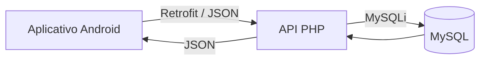

# 📊 Educa Analytics

<p align="center">
  
</p>

<p align="center">
  <strong>Aplicativo Android para coleta, acompanhamento e análise de indicadores educacionais.</strong>
</p>

<p align="center">
  
  
  
  
  
</p>

---

## 📖 Sobre o projeto

O **Educa Analytics** é um aplicativo Android desenvolvido para auxiliar instituições de ensino na **coleta, organização e visualização de informações acadêmicas e institucionais**.

A aplicação reúne dados de diferentes perfis da comunidade escolar — **alunos, professores, funcionários e diretores** — permitindo o preenchimento de formulários avaliativos, acompanhamento de notas e frequência, gerenciamento de usuários e visualização de indicadores por meio de gráficos.

O objetivo é transformar informações coletadas no ambiente escolar em dados que possam contribuir para uma visão mais ampla sobre aspectos como:

- qualidade do ensino;
- clima escolar;
- infraestrutura;
- gestão;
- condições de trabalho;
- participação;
- desempenho acadêmico.

O projeto foi desenvolvido como parte do **PI5**, pelo grupo **Educa Analytics**.

---

## 🎯 Objetivo

O Educa Analytics busca centralizar informações acadêmicas e avaliações institucionais em uma única aplicação.

A proposta é permitir que diferentes integrantes da comunidade escolar forneçam informações de acordo com seu perfil e que esses dados sejam posteriormente consolidados para análise.

O sistema combina:

```text
Avaliações institucionais
        +
Notas e frequência
        +
Informações dos usuários
        ↓
   EDUCA ANALYTICS
        ↓
Indicadores e gráficos
para análise escolar
```

---

## ✨ Funcionalidades

### 🔐 Autenticação

A aplicação possui sistema de login integrado à API.

Após a autenticação, o sistema identifica automaticamente o perfil do usuário e disponibiliza as funcionalidades correspondentes.

Os perfis existentes são:

- `ALUNO`
- `PROFESSOR`
- `FUNCIONARIO`
- `DIRETOR`

---

## 👥 Perfis de usuário

| Perfil | Principais recursos |
|---|---|
| 🎓 **Aluno** | Formulários avaliativos, consulta de notas e frequência, gráficos e dados pessoais |
| 👨‍🏫 **Professor** | Formulários avaliativos, lançamento de notas e frequência, gráficos e dados pessoais |
| 👨‍💼 **Funcionário** | Formulários avaliativos, gráficos e dados pessoais |
| 🏫 **Diretor** | Indicadores da escola, gráficos, gerenciamento de usuários e dados pessoais |

---

## 📝 Formulários avaliativos

O aplicativo disponibiliza questionários diferentes de acordo com o perfil do usuário.

### Alunos

- Autonomia e Protagonismo
- Clima Escolar
- Qualidade do Ensino
- Infraestrutura
- Gestão

### Professores

- Condições de Trabalho
- Qualidade da Educação
- Clima Escolar
- Participação

### Funcionários

- Satisfação no Trabalho
- Eficiência da Gestão
- Infraestrutura

Os formulários utilizam avaliações que são armazenadas no banco de dados e posteriormente utilizadas na geração dos indicadores.

O sistema também verifica quais formulários já foram respondidos pelo usuário, evitando respostas duplicadas.

---

## 📊 Dashboard e indicadores

O Educa Analytics consolida as informações coletadas e disponibiliza uma visão analítica da instituição.

Entre os indicadores apresentados estão:

- média acadêmica da escola;
- resultados dos formulários avaliativos;
- médias agrupadas por perfil de usuário;
- médias agrupadas por formulário;
- comparação entre alunos, professores e funcionários.

A aplicação utiliza gráficos de **barras** e **pizza** para facilitar a interpretação dos dados.

---

## 📈 Gráficos

A visualização dos gráficos é realizada utilizando a biblioteca **MPAndroidChart**.

### Gráfico de barras

Apresenta as médias obtidas nos diferentes formulários avaliativos.

É possível filtrar os resultados pelo tipo de usuário.

### Gráfico de pizza

Apresenta uma comparação dos resultados consolidados entre os diferentes perfis da comunidade escolar.

---

## 🎓 Notas e frequência

### Para alunos

O aluno possui acesso ao seu boletim, podendo consultar:

- disciplina;
- nota;
- frequência.

### Para professores

O professor pode:

1. selecionar uma turma;
2. selecionar um aluno;
3. informar a nota;
4. informar os dados de frequência/faltas;
5. enviar as informações para o servidor.

Os dados são armazenados no banco e ficam posteriormente disponíveis para consulta pelo aluno.

---

## 👤 Gerenciamento de usuários

Usuários com perfil de **Diretor** possuem uma área específica para gerenciamento dos usuários do sistema.

É possível:

- ➕ cadastrar usuários;
- ✏️ editar usuários;
- 🗑️ remover usuários;
- 🔎 consultar usuários;
- 📚 localizar alunos por turma;
- 👨‍🏫 gerenciar professores;
- 👨‍💼 gerenciar funcionários.

O cadastro também considera informações específicas de cada perfil.

### Aluno

- turma.

### Professor

- matéria;
- turmas associadas.

### Funcionário

- função.

---

## 👤 Dados pessoais

Os usuários podem consultar seus dados cadastrados no sistema através da tela de **Dados Pessoais**.

Entre as informações armazenadas estão:

- login;
- nome;
- CPF;
- data de nascimento;
- telefone;
- tipo de usuário.

---

# 🛠️ Tecnologias utilizadas

## Aplicativo Android

- **Kotlin 1.9.0**
- **Android SDK**
- **Jetpack Compose**
- **Material Design 3**
- **Navigation Compose**
- **Gradle Kotlin DSL**

### Configuração Android

```text
Min SDK:     24
Target SDK:  35
Compile SDK: 35
```

---

## 🌐 Comunicação com o servidor

- **Retrofit 2**
- **Gson Converter**
- **OkHttp**

A comunicação entre o aplicativo e o backend é realizada utilizando requisições HTTP e dados em formato JSON.

---

## 📊 Visualização de dados

- **MPAndroidChart**

Utilizado para criação dos gráficos de barras e pizza apresentados pelo aplicativo.

---

## 🖥️ Backend

O backend disponível neste repositório foi desenvolvido em:

- **PHP**
- **MySQL / MySQLi**
- **JSON**

Os principais arquivos responsáveis pela API são:

```text
api.php
api_extra.php
```

---

## 🗄️ Banco de dados

O banco utilizado pela aplicação é o **MySQL**.

O script de criação está disponível em:

```text
banco pessoa.sql
```

O banco principal é chamado:

```text
educa
```

### Principais tabelas

```text
usuario
escola
pessoa
turmas
aluno
professor
funcionario
boletim
respostas
```

### Relacionamento geral

```text
                    ┌────────────┐
                    │  usuario   │
                    └─────┬──────┘
                          │
                          ▼
                    ┌────────────┐
                    │   pessoa   │
                    └─────┬──────┘
                          │
          ┌───────────────┼───────────────┐
          │               │               │
          ▼               ▼               ▼
      ┌───────┐      ┌───────────┐   ┌─────────────┐
      │ aluno │      │ professor │   │ funcionario │
      └───┬───┘      └───────────┘   └─────────────┘
          │
          ├────────────► boletim
          │
          ▼
        turma

usuario ─────────────► respostas
pessoa ──────────────► escola
```

---

# 🏗️ Estrutura do projeto

A estrutura principal está organizada da seguinte forma:

```text
PI5
│
├── app
│   └── src
│       └── main
│           ├── java
│           │   └── br/com/analytics/educa
│           │       │
│           │       ├── MainActivity.kt
│           │       │
│           │       ├── data
│           │       │   ├── model
│           │       │   └── retrofit
│           │       │
│           │       └── ui
│           │           ├── component
│           │           │   ├── design
│           │           │   ├── dialogs
│           │           │   └── usecase
│           │           │
│           │           ├── route
│           │           │
│           │           └── screen
│           │               ├── forms
│           │               ├── graphs
│           │               ├── login
│           │               ├── menu
│           │               ├── notas
│           │               └── users
│           │
│           └── res
│               ├── drawable
│               ├── mipmap
│               ├── values
│               └── xml
│
├── api.php
├── api_extra.php
├── banco pessoa.sql
├── build.gradle.kts
├── settings.gradle.kts
└── README.md
```

---

# 🧩 Organização do código Android

## `data/retrofit`

Responsável pela comunicação com a API.

Principais arquivos:

```text
ApiService.kt
RetrofitClient.kt
```

`ApiService.kt` define as operações utilizadas pelo aplicativo, como:

- autenticação;
- consulta de formulários;
- envio de respostas;
- consulta de notas;
- consulta de usuários;
- gerenciamento de usuários;
- consulta de dados escolares;
- lançamento de notas e frequência.

---

## `data/model`

Contém os métodos responsáveis pelo consumo da API e tratamento dos dados retornados pelo servidor.

---

## `ui/screen`

Contém as principais telas da aplicação.

```text
forms/      → formulários avaliativos
graphs/     → indicadores e gráficos
login/      → autenticação
menu/       → menus e navegação
notas/      → boletim e lançamento de notas
users/      → dados pessoais e gerenciamento de usuários
```

---

## `ui/component`

Contém componentes reutilizáveis utilizados pelas telas.

Entre eles:

- gráficos;
- avaliação por estrelas;
- diálogos;
- campos de formulário;
- validadores e formatadores.

---

## `ui/route`

Contém as rotas utilizadas pelo **Navigation Compose**.

---

# 🔄 Arquitetura de comunicação



O aplicativo não acessa o banco de dados diretamente.

A comunicação acontece da seguinte forma:

```text
Jetpack Compose
      │
      ▼
Camada de dados
      │
      ▼
Retrofit
      │
      ▼
API PHP
      │
      ▼
MySQL
```

---

# 🧭 Navegação da aplicação

A navegação principal é controlada através do **Navigation Compose**.

Fluxo simplificado:

```text
Tela Inicial
     │
     ▼
   Login
     │
     ▼
Verificação do usuário
     │
     ▼
Menu principal
     │
     ├────► Gráficos
     │
     ├────► Dados pessoais
     │
     ├────► Formulários
     │
     ├────► Notas
     │
     └────► Gerenciamento de usuários
                │
                ▼
             Diretor
```

As opções exibidas no menu dependem do perfil autenticado.

---

# 🚀 Como executar o projeto

## Pré-requisitos

Para executar o aplicativo é necessário possuir:

- **Android Studio**
- Android SDK instalado
- dispositivo Android ou emulador
- acesso ao backend PHP
- servidor web com PHP
- MySQL ou MariaDB

---

## 1. Clone o repositório

```bash
git clone https://github.com/ThiagoGatti/PI5.git
```

Entre na pasta:

```bash
cd PI5
```

---

## 2. Abra o projeto no Android Studio

No Android Studio:

```text
File
  → Open
  → selecione a pasta PI5
```

Aguarde a sincronização do Gradle.

---

## 3. Configure o banco de dados

O arquivo:

```text
banco pessoa.sql
```

contém a estrutura utilizada pelo projeto.

Importe esse arquivo em uma instância MySQL ou MariaDB.

Exemplo pelo terminal:

```bash
mysql -u root -p < "banco pessoa.sql"
```

O script cria o banco:

```text
educa
```

e as tabelas necessárias para funcionamento da aplicação.

---

## 4. Configure a API

Os arquivos responsáveis pelo backend são:

```text
api.php
api_extra.php
```

Eles devem estar disponíveis em um servidor web com suporte a PHP.

Configure a conexão com o banco utilizando os dados do seu ambiente.

> **Importante:** não publique usuário, senha ou outras credenciais reais do banco de dados no GitHub.

Em um ambiente de produção, utilize variáveis de ambiente ou outro mecanismo seguro para armazenar credenciais.

---

## 5. Configure o endereço da API

O endereço utilizado pelo aplicativo está definido em:

```text
app/src/main/java/br/com/analytics/educa/data/retrofit/RetrofitClient.kt
```

A propriedade responsável é:

```kotlin
BASE_URL
```

Para um backend executando na própria máquina durante testes com o emulador Android, normalmente pode ser utilizado:

```text
http://10.0.2.2/
```

Para um dispositivo físico, utilize um endereço do servidor que possa ser acessado pelo dispositivo.

---

## 6. Execute o aplicativo

Selecione um dispositivo ou emulador no Android Studio e execute:

```text
Run ▶
```

O aplicativo suporta dispositivos a partir do:

```text
Android API 24
```

---

# 🔌 Principais operações da API

A aplicação utiliza operações como:

```text
login
getAnsweredForms
saveAnswers
getResponsesBySchool
schoolPerformance
getBoletim
getUsersByType
getUsersByTurma
getTurmas
getUserDetails
createUserCompleto
updateUserCompleto
removeUser
enviarNotaPresenca
```

Essas operações permitem que o aplicativo concentre a lógica de interface no Android enquanto o backend realiza a comunicação com o banco.

---

# 🔐 Segurança

Para ambientes de desenvolvimento ou produção, recomenda-se:

- não manter senhas de banco diretamente no código;
- utilizar variáveis de ambiente no backend;
- não versionar arquivos contendo credenciais;
- utilizar HTTPS;
- restringir o acesso à API;
- validar os dados recebidos pelo servidor;
- utilizar mecanismos seguros para autenticação e armazenamento de senhas.

---

# 👨‍💻 Integrantes

Projeto desenvolvido pelo grupo **Educa Analytics**:

- **Vinícius Ferreira Scott**
- **Thiago Gatti Bafi**
- **Hevillyn Oliveira Klein**
- **Aline Elaine da Silva**

---

# 📚 Materiais do projeto

O repositório também contém materiais complementares na pasta:

```text
PI5/
```

Entre eles:

```text
PI EDUCA ANALYTICS.pdf
IntegrantesGrupo.txt
NomeGrupo.txt
qrcode.png
Fotos da tela.zip
```

---

# 📌 Versão

Versão atual definida no projeto Android:

```text
Version Code: 1
Version Name: 1.0
```

---

# 💡 Visão geral

O **Educa Analytics** busca transformar dados escolares em informações de fácil interpretação.

Ao combinar **avaliações da comunidade escolar**, **dados acadêmicos** e **visualizações gráficas**, o aplicativo cria uma ferramenta centralizada para acompanhamento de diferentes aspectos da instituição de ensino.

<p align="center">
  <strong>📊 Educa Analytics</strong><br>
  Dados educacionais transformados em informação.
</p>
